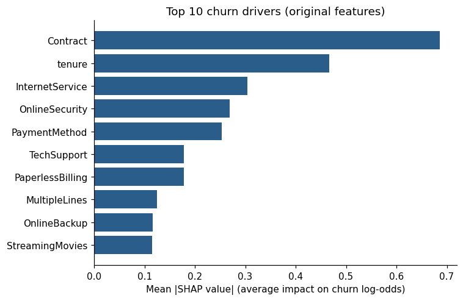
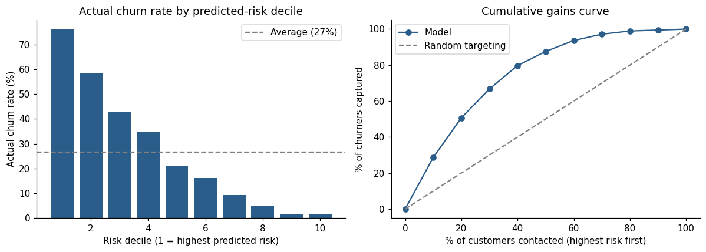

# Customer Churn Prediction & Business Intelligence: Telecom

Predicts which telecom customers are most likely to leave, explains why, and estimates the revenue at stake if the highest-risk customers are contacted with a retention offer.

## Business problem
A telecom provider loses about one in four customers. The retention team can only contact a limited number of people, so it needs to know who is most at risk, why they leave, and what the revenue impact of targeting the highest-risk group would be.

## Dataset
[IBM Telco Customer Churn sample dataset](https://github.com/IBM/telco-customer-churn-on-icp4d): 7,043 customers, 20 features (contract, tenure, services, billing) and a `Churn` label (26.5% churned). The source repository is licensed under Apache-2.0; a copy of the licence is in `data/`.

## Approach
SQL exploration in SQLite, data cleaning, a preprocessing pipeline with a stratified train/test split, and SMOTE applied only inside cross-validation to avoid leakage. XGBoost is tuned with 5-fold cross-validation and compared against Logistic Regression and Random Forest baselines, evaluated on a hold-out set with bootstrap confidence intervals. SHAP explains the model's predictions, and the results are used to rank customers by risk, size the top 20%, and model a retention campaign scenario. Outputs are exported for a Tableau dashboard.

## Key results
| Measure | Result |
|---|---|
| Best model | Tuned XGBoost (with SMOTE) |
| Hold-out ROC AUC | **0.843** (95% bootstrap interval about 0.82 to 0.87); cross-validated 0.848 |
| Baselines (hold-out AUC) | Logistic Regression 0.840, Random Forest 0.840 (differences are within noise) |
| Effect of SMOTE | XGBoost churner recall 0.52 to 0.63 (cross-validated); Logistic Regression 0.54 to 0.79 |
| Top 3 churn drivers (SHAP) | Contract type, tenure, internet service |
| Top 20% highest-risk customers | 1,408 customers, 67.2% churn rate (2.5x average), containing 50.6% of all churners |
| Revenue at stake | Churners in the top 20% represent about 889,000 in annual revenue, 53% of total churn revenue (about 334,000 expected from random targeting) |

The revenue scenario (30% save rate, 20 per contact) is an assumption you can edit in the notebook, not a result from the data. The dataset does not state a currency.




## Repository structure
```
.
├── customer_churn_prediction.ipynb   # the full analysis (outputs included)
├── data/
│   ├── Telco-Customer-Churn.csv
│   └── LICENSE-IBM-telco-dataset-Apache-2.0.txt
├── outputs/
│   ├── figures/                      # charts used in this README
│   ├── tableau/                      # CSVs for the dashboard
│   └── baseline_cv_results.csv
├── requirements.txt
└── README.md
```

## How to run
1. Install Python 3.11 or newer.
2. In a terminal inside this folder:
   ```
   python -m venv .venv
   source .venv/bin/activate          # Windows PowerShell: .venv\Scripts\Activate.ps1
   pip install -r requirements.txt
   jupyter lab
   ```
3. Open `customer_churn_prediction.ipynb` and choose **Run > Run All Cells**. Allow roughly 10 minutes on a laptop, because the tuning step trains many models.

All random steps use `random_state=42`, so results are repeatable on the tested library versions.

## Limitations
Sample teaching data with no time dimension; the three tuned models score within a few thousandths of AUC of each other; SHAP shows association, not causation. Full discussion in the notebook.

## Acknowledgements
Dataset: IBM Telco Customer Churn sample. Libraries: pandas, scikit-learn, imbalanced-learn, XGBoost, SHAP, matplotlib.
